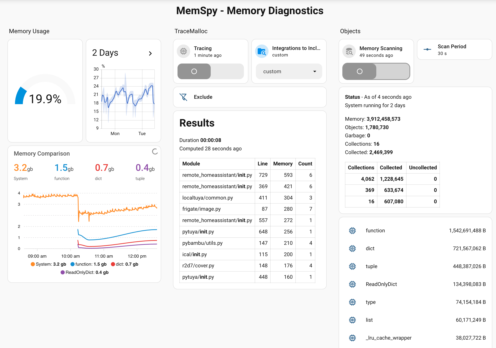

# MemSpy

[](https://github.com/hacs/integration)
[](https://github.com/dubnom/memspy/releases)
[](https://github.com/dubnom/memspy/commits/main)
[](LICENSE)

[](https://my.home-assistant.io/redirect/hacs_repository/?owner=dubnom&repository=memspy&category=integration)
[](https://my.home-assistant.io/redirect/config_flow_start/?domain=memspy)

*Written by Michael Dubno* -
Version: 1.2.13

A Home Assistant custom integration used for debugging memory issues. It reports memory allocations by integrations, Python object memory usage, and garbage-collector statistics. It exposes all of this through standard Home Assistant entities.

## Purpose and Concepts

Some integrations leak memory and cause Home Assistant to eventually crash - an issue primarily with custom integrations. It has been difficult and requires some skill to determine which integrations are leaking, and even harder to find the suspicious code.  This affects all developers and users of custom integrations.  MemSpy is designed to make finding leaks easier. It is implemented as a standard integration that allows full Home Assistant use - Lovelace panels, automations, etc.

MemSpy tools run only on demand to conserve memory and CPU.

Three ways of looking at memory:
- Tracing the allocation of memory in the code - [tracemalloc](https://docs.python.org/3/library/tracemalloc.html)
- Watching object memory use - [gc](https://docs.python.org/3/library/gc.html)
- Examining the garbage collector - [gc](https://docs.python.org/3/library/gc.html)

### Using `tracemalloc` entities:
The `select.memspy_tracemalloc_include` controls the integrations that will be examined. There are special options for `all` and `custom`.
Switching on `switch.memspy_tracemalloc_active` starts the trace. Turning it off populates the `snapshot` attribute of `sensor.memspy_tracemalloc` with a list of `{filename, line number, memory, and count}`. The list is only includes integrations that match `select.memspy_tracemalloc_include`. The list is limited to `number.mempy_results_limit` and is sort from high to low based on memory usage.

### Using `memory` entities:
Approaching memory issues by seeing how Python objects use memory is another path for finding leaks. The  `gc` library is used to expose the Python classes, the object count, and the total amount of memory consumed. A `sensor.memspy_class_###` is create from 1 to `sensor.memspy_results_limit`.  The class sensors have - the Python class name, the state is the memory used, and a `count` attribute for number of instances. `number.memspy_memory_scan_frequency` controls how often these class entities update. `switch.memspy_memory_scanning` starts and stops the scanning.

`sensor.memspy` tracks Python garbage collector data. The state is the `object count` and the attributes are:
- Attribute
- Collected
- Collections
- Uncollectable
- Garbage
- Gc stats (list)
  - collections
  - collected
  - uncollectable
- Memory
- Object count

The [gc](https://docs.python.org/3/library/gc.html) documentation provides an explanation for what the garbage collector does, and what these values mean.

## Finding Leaks

When looking for memory leaks, we're looking for any memory number that continuously grows. The workflow that works best (for me) is -
- Use `sensor.memory_use_percent` from Home Assistant's System Monitor integration and chart it over time.
- Check third-party app memory usage with the System Monitor integration. Rule this out before diving into individual integrations.
- Set `tracemalloc` entities to `custom` and start `tracemalloc`. Let it run for a few minutes and then turn it off and check the results. The list is sorted from largest memory use to smallest. Integrations may show up multiple times with different seqments of suspect code. Performing the step a number of times, or over long time spans, usually finds the leading culprits.  Examine the code in the [File Editor](https://github.com/home-assistant/addons/blob/master/configurator/DOCS.md) addon.
- If you suspect a specific integration, change the include filter to the name of your integration.
- Disable the integration for a long enough period of time to see if it really was the offender.
- If a leaky integration wasn't found, try the same process using `all` for the include.
- If you are still searching, use the `memory` sensors to examine the classes using the most memory, and look at charts of their memory and instance growth.
- Finally, check `sensor.memspy` to make sure the garbage collector is working.

Using the profiler and turning on debugging for specific integrations is also helpful. However, the profiler puts an enormous load on the system making it difficult to use while dealing with memory exhaustion. The debug logging also has its limits - it relies on the developer to embed logging statemments, and for these log entries to be something you care about. Debug writes to logs, and requires you to read through them. Debug and Logs are extremely useful to fix integrations generating errors.

A good description of how memory works and how to find leaks read - [How to Debug Memory Leaks in Python](https://oneuptime.com/blog/post/2026-01-24-debug-memory-leaks-python/view)

## Features

- `number.memspy_memory_scan_frequency` — sets the automatic object-memory scan interval in seconds. It defaults to `30`.
- `switch.memspy_memory_scanning` — enables or disables periodic object-memory scanning. It is disabled by default. Object-memory scanning is controlled by this frequency number and switch; there are no refresh or set-frequency services.
- `number.memspy_results_limit` — sets how many of the highest-memory classes receive class sensors and how many tracemalloc rows are returned. Its current default is `10`.
- `select.memspy_tracemalloc_include` — selects the tracemalloc include source: `all`, `custom`, or a configured integration domain. Its `code_location` attribute exposes the resolved source directory for the current selection.
- `text.memspy_tracemalloc_exclude` — newline-separated tracemalloc filename patterns to exclude. It defaults to an empty value; Memspy and Spook are always excluded in addition to any patterns entered here. Blank lines and lines beginning with `#` are ignored.
- `switch.memspy_tracemalloc_active` — starts tracemalloc when enabled and captures a final snapshot, fires the `memspy_tracemalloc_snapshot` event, and stops tracemalloc when turned off.
- `sensor.memspy_tracemalloc_duration` — reports the elapsed tracemalloc session time in seconds and keeps the final duration after tracing stops.
- `sensor.memspy_tracemalloc` — stores the number of rows in the most recent snapshot and exposes the top-N snapshot as JSON in its `snapshot` attribute.
- `sensor.memspy` — global summary sensor for total live objects, memory, garbage-collector statistics, and GC stats.
- `sensor.class_001`, `sensor.class_002`, etc. — rank slots for supported Python classes, ordered by memory usage.

Only the configured highest-memory classes receive class sensors. The set is updated during the next object-memory scan.

Class sensor friendly names are the raw Python class names, without the `Memspy` prefix.

## Installation

### HACS (recommended)

1. Ensure [HACS](https://hacs.xyz) is installed.
2. Add this repository as a custom repository in HACS: **HACS → Integrations → ⋮ → Custom repositories**, enter `https://github.com/dubnom/memspy`, category **Integration** — or use the button below.
   [](https://my.home-assistant.io/redirect/hacs_repository/?owner=dubnom&repository=memspy&category=integration)
3. Search for **MemSpy** in HACS and install it.
4. Restart Home Assistant.
5. Go to **Settings → Devices & Services → Add Integration**, search for **MemSpy**, and add it — or use the button below.
   [](https://my.home-assistant.io/redirect/config_flow_start/?domain=memspy)

### Manual

1. Copy `custom_components/memspy` into your Home Assistant `config/custom_components/` directory.
2. Restart Home Assistant.
3. Add the integration from **Settings → Devices & Services → Add Integration → MemSpy**.

## Usage

Set `number.memspy_memory_scan_frequency` to the desired interval in seconds, then use `switch.memspy_memory_scanning` to enable or disable object-memory scanning.

Use `select.memspy_tracemalloc_include` and `text.memspy_tracemalloc_exclude` to configure filtering. The include select offers:

- `all` — include allocations from every source.
- `custom` — include the `/config/custom_components` tree.
- a configured integration domain — include that integration's source tree.

The select exposes a `code_location` attribute with the resolved source directory for the current selection. Enable `switch.memspy_tracemalloc_active` to start tracing. Turning it off captures the final top-N allocation snapshot and stops tracing.

`text.memspy_tracemalloc_exclude` accepts newline-separated filename patterns. Blank lines and lines beginning with `#` are ignored; Memspy and Spook paths are always excluded in addition to the configured patterns.

The summary sensor exposes the overall GC snapshot and total object count. The class sensors expose memory and count for each top-memory Python class. Use `number.memspy_results_limit` to adjust the supported classes and returned tracemalloc rows; its default is `10`.

## Sensor examples

- `sensor.memspy` state: total object count
- `sensor.memspy` attributes: `memory`, `garbage`, `collections`, `collected`, `uncollectable`, `gc_stats`
- `switch.memspy_memory_scanning` state: `on` when object-memory scanning is active
- `number.memspy_memory_scan_frequency` state: scan interval in seconds
- `switch.memspy_tracemalloc_active` state: `on` when tracemalloc is active
- `sensor.memspy_tracemalloc_duration` state: elapsed tracemalloc time in seconds
- `select.memspy_tracemalloc_include` state: `all`, `custom`, or an integration domain
- `text.memspy_tracemalloc_exclude` state: current exclusion patterns
- `sensor.class_001` state: estimated memory for the highest-memory class

## User Interface (Lovelace)

A dedicated **MemSpy** dashboard is auto installed by the integration and appears in the Home Assistant sidebar at `/lovelace/memspy-dashboard`. Upgrading MemSpy may overwrite its `memspy` view, so copy or rename the view if you customize it. If the dashboard does not appear automatically, press the MemSpy device's **Install dashboard** button or call the `memspy.install_dashboard` action. The following custom cards (from HACS) are used:
- [custom:custom-icons](https://github.com/thomasloven/hass-custom_icons)
- [custom:apex_charts](https://github.com/romrider/apexcharts-card)
- [custom:mushroom-select-card](https://github.com/piitaya/lovelace-mushroom/blob/main/docs/cards/select.md)
- [custom:auto-entities](https://github.com/thomasloven/lovelace-auto-entities)



## Development

```bash
pip install -r requirements_test.txt
pytest
```

## License

[MIT](LICENSE)
